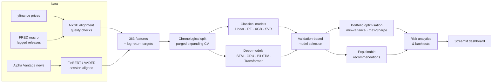

<div align="center">

# 📈 Stock AI & Portfolio Intelligence System

**Leakage-aware stock forecasting, financial news sentiment and portfolio research — end to end.**


</div>

---

This project forecasts adjusted prices for **10 large-cap U.S. stocks** at **1- and 5-session horizons**. It benchmarks **8 model families** — four classical, four deep learning — against a random-walk baseline, and turns the forecasts into portfolio allocations and explainable buy/hold/sell recommendations. It was built during a project-based internship at Internmo.

The focus is on **evaluation you can trust** rather than headline accuracy. Every split is chronological, labels that leak across blocks are purged, scalers are fit on training data only, models are selected on validation, and the random walk is kept as an honest yardstick — even when it wins.

## ✨ Highlights

- **9-way model benchmark.** Random walk, Linear/Ridge, Random Forest, XGBoost, SVR, LSTM, GRU, Bidirectional LSTM and a Transformer encoder, all scored on identical forecast origins.
- **Leakage-aware validation.** Expanding-window cross-validation with purging, strictly within-block sequence windows, training-only scaling, and a separate calibration block for prediction intervals.
- **363 engineered features.** Technical indicators, volatility, volume, lagged returns, calendar effects, market breadth and lag-adjusted FRED macro series.
- **Financial NLP.** FinBERT and VADER sentiment, aligned to NYSE trading sessions, with explicit tracking of news-coverage gaps.
- **Portfolio engine.** Ledoit–Wolf covariance, minimum-variance and maximum-Sharpe optimisation, an efficient frontier cross-checked against 20,000 Monte Carlo portfolios, and bootstrap Sharpe confidence intervals.
- **Realistic execution.** Signals form at the close and fill at the next open, with transaction costs. Fixed holdings drift instead of being rebalanced for free.
- **Reproducible runs.** Every run saves its config, data and source hashes, package versions, models, scalers, per-origin predictions and loss curves.
- **Interactive dashboard.** A seven-panel Streamlit app for exploring any completed run.

## 🏗️ Architecture



## 📊 Results

> Results come from the full run `prd-recovered-full`: 10 stocks × 2 horizons × 9 models, with data from 2015-10-16 to 2026-08-26 (2,730 sessions). The test period was inspected during development, so treat these numbers as historical rather than a pristine holdout.

### Forecasting — test MAE averaged across all 10 stocks

| Model | 1-day MAE ($) | vs. random walk | 5-day MAE ($) | vs. random walk |
| --- | ---: | ---: | ---: | ---: |
| **Random walk (baseline)** | **3.568** | — | 8.188 | — |
| SVR | 3.569 | +0.0% | 8.254 | +0.8% |
| LSTM | 3.580 | +0.3% | **8.157** | **−0.4%** |
| Random Forest | 3.593 | +0.7% | 8.401 | +2.6% |
| XGBoost | 3.606 | +1.1% | 8.422 | +2.9% |
| Transformer | 3.649 | +2.3% | 8.275 | +1.1% |
| GRU | 3.654 | +2.4% | 8.477 | +3.5% |
| BiLSTM | 3.828 | +7.3% | 8.952 | +9.3% |
| Linear / Ridge | 6.799 | +90.6% | 20.944 | +155.8% |

**Takeaway:** daily stock prices are very close to a random walk. The best models only match the baseline, and only the LSTM edges it at the 5-day horizon. Of the 20 models chosen on validation (one per stock and horizon), the Transformer was picked 12 times, but only 3 of the 20 beat the random walk on test MAE. This negative result is reported on purpose — it is what honest evaluation of daily stock prediction usually looks like.

### Portfolio — out-of-sample, 2025-04-07 → 2026-08-26

A single allocation is made at the 2025-04-03 close and filled at the next open. Holdings then stay fixed and their weights drift. Costs are 10 bps one way.

| Strategy | CAGR | Volatility | Sharpe | Sortino | Max drawdown | Beta |
| --- | ---: | ---: | ---: | ---: | ---: | ---: |
| Maximum Sharpe | 58.0% | 20.8% | **2.11** | **3.36** | −12.3% | 0.82 |
| Equal weight | 41.6% | 15.8% | 2.04 | 3.24 | −7.3% | 0.85 |
| Minimum variance | 27.5% | 14.2% | 1.50 | 2.18 | −8.4% | 0.30 |
| S&P 500 benchmark | 30.6% | 16.4% | 1.47 | 2.29 | −8.7% | 1.00 |
| Recommendation strategy | 7.5% | **3.0%** | 1.11 | 2.99 | **−1.2%** | 0.04 |

The test window starts just after the April 2025 sell-off, so every long-only strategy benefits from the rebound. Bootstrap 95% Sharpe intervals are wide — for example 0.88 to 4.35 for maximum Sharpe — so the ranking is not statistically decisive.

### Earlier classification experiment

An earlier phase of the project predicted AAPL's next-day **direction** with six models: Logistic Regression, Random Forest, Gradient Boosting, XGBoost, LSTM and GRU. Random Forest looked strongest in walk-forward validation, with 52.99% accuracy and a ROC-AUC of 0.527, but it did **not** beat a naive always-up baseline (53.31%). On a later fixed holdout, its ROC-AUC fell to 0.49, with 51.14% accuracy. A long/cash strategy built on it reached a Sharpe of 0.90, against 0.76 for buy-and-hold.

Adding FinBERT sentiment from about 18,800 articles did **not** improve the model (−0.008 AUC), so it was excluded. In the portfolio phase, a maximum-Sharpe allocation reached a Sharpe of 1.45 in training but only 0.99 over 21 unseen months once its weights were locked, below a minimum-variance portfolio at 1.54. Full details are in [docs/CLASSIFICATION_EXPERIMENT.md](docs/CLASSIFICATION_EXPERIMENT.md).

## 🚀 Quick start

```bash
git clone https://github.com/Aditi-71/Stock-AI-Portfolio-Intelligence-System.git
cd Stock-AI-Portfolio-Intelligence-System

conda create -n stock-ai python=3.11 -y
conda activate stock-ai
pip install -r requirements-prd.txt

python -m unittest discover -s tests/prd -v

python -m src.prd rebuild
python -m src.prd train --models naive --tickers AAPL --horizons 1 --run-name baseline-check
python -m src.prd train --run-name prd-full
python -m src.prd all --run-name prd-all

streamlit run dashboard/prd_app.py
```

`rebuild` downloads a fresh price and macro snapshot and prepares features. The single-stock baseline makes a quick sanity check before the long full run. See **[docs/RUNNING.md](docs/RUNNING.md)** for the full walkthrough and a description of every output file.

### CLI reference

| Command | Description |
| --- | --- |
| `python -m src.prd rebuild` | Download prices (yfinance) and macro data (FRED), then prepare |
| `python -m src.prd prepare` | Prepare features from existing raw Parquet files |
| `python -m src.prd train [--models …] [--tickers …] [--horizons …] --run-name NAME` | Train and evaluate models |
| `python -m src.prd eda [--run-dir DIR]` | Stationarity, distribution, seasonality and correlation analysis |
| `python -m src.prd portfolio [--run-dir DIR]` | Optimisation, frontier, backtests and recommendations |
| `python -m src.prd vader` | Score news with VADER |
| `python -m src.prd sentiment [--run-dir DIR]` | Paired with/without-sentiment comparison |
| `python -m src.prd report [--run-dir DIR]` | Generate a results-backed Markdown report draft |
| `python -m src.prd all --run-name NAME` | Train, EDA, portfolio, sentiment and report in one go |
| `python recover_prd.py` | Resume an out-of-memory run, one model per process ([guide](docs/RECOVERY.md)) |
| `python collect_news_prd.py [--fetch]` | Budgeted, resumable news collection ([guide](docs/NEWS_COLLECTION.md)) |

Settings such as the stock universe, date range, horizons, model hyperparameters, portfolio constraints and costs all live in [`config.yaml`](config.yaml).

## 🔬 Methodology

<details>
<summary><b>Targets and metrics</b></summary>

For horizon *h* the target is the adjusted log return

$$y_t = \log\frac{P_{t+h}}{P_t}$$

Predictions are inverse-scaled and turned back into prices with $\hat P_{t+h} = P_t \cdot e^{\hat y_t}$. RMSE, MAE, MAPE and R² are computed on these **reconstructed prices**. Directional accuracy compares the predicted and actual change from the forecast origin. The random walk predicts no change, so under strict sign matching its directional score is the unchanged-price fraction, not an assumed 50%.

</details>

<details>
<summary><b>Validation design</b></summary>

- Chronological 70 / 15 / 15 train / validation / test split. Validation is further split into model selection with early stopping, and interval calibration.
- Expanding-window CV with 5 folds. Labels that reach into the next block are purged.
- Sequence windows never cross a block boundary. Classical and deep models are scored on the same origins, using a 60-session lookback.
- Feature and target scalers are fit only on each fold's training data.
- The model for each stock and horizon is the one with the lowest validation price MAE. The test set never selects a model.
- Prediction intervals come from absolute-residual quantiles on the calibration block.

</details>

<details>
<summary><b>Models</b></summary>

| Family | Details |
| --- | --- |
| Random walk | Future price equals current price |
| Linear / Ridge | OLS and Ridge candidates chosen by expanding-window CV |
| Random Forest | Tuned tree count, depth and leaf size |
| XGBoost | Squared-error regression with time-series tuning |
| SVR | Linear and RBF kernels, with scaling inside each fold |
| LSTM / GRU | Stacked recurrent layers, dropout, linear regression head |
| Bidirectional LSTM | Both directions stay inside the historical window |
| Transformer | Sinusoidal positional encoding, two attention + feed-forward blocks |

All deep models use Huber loss and train for up to 200 epochs with early stopping (patience 12), batch size 64 and a learning rate of 1e-3.

</details>

<details>
<summary><b>Data and features</b></summary>

- Prices are aligned to the NYSE calendar. Duplicate conflicts and single-day fills are logged. Long gaps and OHLC violations are rejected, and market outliers are flagged for review rather than removed.
- Features include returns, moving-average ratios, MACD, RSI, stochastic oscillator, volatility, ATR, Bollinger bands, volume and OBV changes, lagged prices and returns, calendar variables, VIX, a market-breadth proxy, and FRED macro series.
- Macro series are lagged by conservative release delays before as-of alignment: 2 days for 10Y and 3M Treasury yields, 45 days for unemployment, 60 days for CPI.

</details>

<details>
<summary><b>Portfolio and recommendations</b></summary>

- Expected returns blend 75% historical mean with 25% model-implied return. Covariance uses Ledoit–Wolf shrinkage. Portfolios are long-only with a 30% cap per asset.
- The efficient frontier is verified against 20,000 random feasible portfolios.
- Recommendations combine forecast, sentiment and risk sub-scores (weights 0.5 / 0.2 / 0.3) with buy/sell thresholds, a 5% rebalance band and 10 bps costs. Hit rates are reported, and missing sentiment is shown as missing rather than filled with zero.
- Risk metrics: volatility, beta, Sharpe, Sortino, max drawdown, Calmar, empirical VaR/CVaR, and moving-block bootstrap Sharpe intervals.

</details>

## 🖥️ Dashboard

```bash
streamlit run dashboard/prd_app.py
```

The regression dashboard lets you choose any completed run, stock and horizon, then explore seven tabs: **Overview · Forecasting · Model comparison · Portfolio · Risk · Sentiment · Recommendations**.

The earlier classification project has its own multi-page app (`streamlit run dashboard/Overview.py`) covering ML forecasting, news sentiment, and portfolio and risk.

## 📁 Project structure

```text
Stock-AI-Portfolio-Intelligence-System/
├── src/
│   ├── prd/                  # Regression workflow (python -m src.prd)
│   │   ├── __main__.py       #   CLI entry point
│   │   ├── config.py         #   Config loading, paths, hashing
│   │   ├── prepare.py        #   Download, NYSE alignment, quality checks, features
│   │   ├── data.py           #   Targets, splits, purged walk-forward blocks
│   │   ├── models_ml.py      #   Classical models and time-series tuning
│   │   ├── models_dl.py      #   LSTM, GRU, BiLSTM, Transformer
│   │   ├── experiment.py     #   Training, selection, persistence
│   │   ├── metrics.py        #   Price-space metrics, calibration
│   │   ├── maths.py          #   Gradient descent, covariance, risk metrics
│   │   ├── eda.py            #   Exploratory analysis
│   │   ├── sentiment.py      #   FinBERT/VADER paired experiments
│   │   ├── portfolio.py      #   Optimisation, frontier, backtests
│   │   ├── recommend.py      #   Scores, signals, execution simulation
│   │   └── report.py         #   Markdown results draft
│   └── *.py                  # Earlier classification, sentiment and portfolio scripts
├── dashboard/
│   ├── prd_app.py            # Regression dashboard
│   ├── Overview.py           # Classification dashboard (multi-page)
│   └── pages/
├── tests/
│   ├── prd/                  # Contract, integration and recovery tests
│   └── news_collection/      # News collector tests (mocked API)
├── experiments/              # Feature selection, permutation importance, threshold tuning
├── scripts/maintenance/      # One-off news-repair utilities
├── docs/                     # Guides and experiment write-ups
├── recover_prd.py            # Out-of-memory recovery runner
├── collect_news_prd.py       # Budgeted news collector
├── config.yaml               # All experiment settings
└── requirements*.txt
```

`data/` and `reports/` are generated locally and are not tracked in git.

## 🧪 Testing

```bash
python -m unittest discover -s tests/prd -v
python -m unittest discover -s tests/news_collection -p test_collect_news_prd.py -v
```

35 tests cover the leakage contract (future-data isolation, exact target shifts, split boundaries), end-to-end experiments, execution timing, portfolio maths, recovery integrity and the news collector. They run on synthetic data only. See [docs/TESTING.md](docs/TESTING.md).

## 📚 Documentation

| Document | Contents |
| --- | --- |
| [docs/RUNNING.md](docs/RUNNING.md) | Full workflow walkthrough and run outputs |
| [docs/RECOVERY.md](docs/RECOVERY.md) | Resuming an interrupted training run |
| [docs/NEWS_COLLECTION.md](docs/NEWS_COLLECTION.md) | Budgeted, resumable news collection |
| [docs/TESTING.md](docs/TESTING.md) | Test coverage and latest results |
| [docs/STATUS.md](docs/STATUS.md) | Implementation status and methodological decisions |
| [docs/CLASSIFICATION_EXPERIMENT.md](docs/CLASSIFICATION_EXPERIMENT.md) | Earlier direction-classification experiment |

## ⚠️ Limitations

- **Test exposure.** The historical test period was inspected during development, so it is not a genuinely unseen holdout.
- **Macro revisions.** FRED data is a current-vintage snapshot. Release lags are approximated, and later revisions are not removed.
- **Survivorship bias.** The universe is a fixed set of large caps that survived to today.
- **News coverage.** Historical news coverage is incomplete, so the paired sentiment comparisons for the regression workflow are still pending.
- **Simplified execution.** No bid/ask spread, market impact or taxes are modelled.

## 📄 Disclaimer

This is an educational research project. It does not place brokerage orders, does not give financial advice, and past performance does not guarantee future results.

## 👤 Author

**Aditi Biswas**. Built during a project-based internship(2026).
